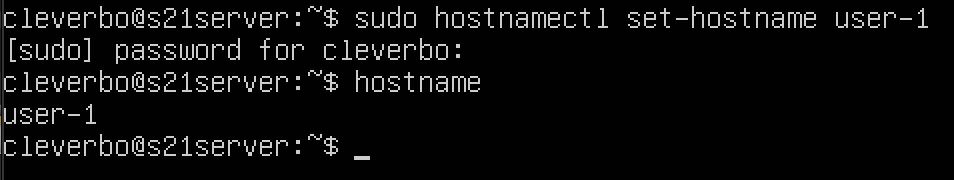
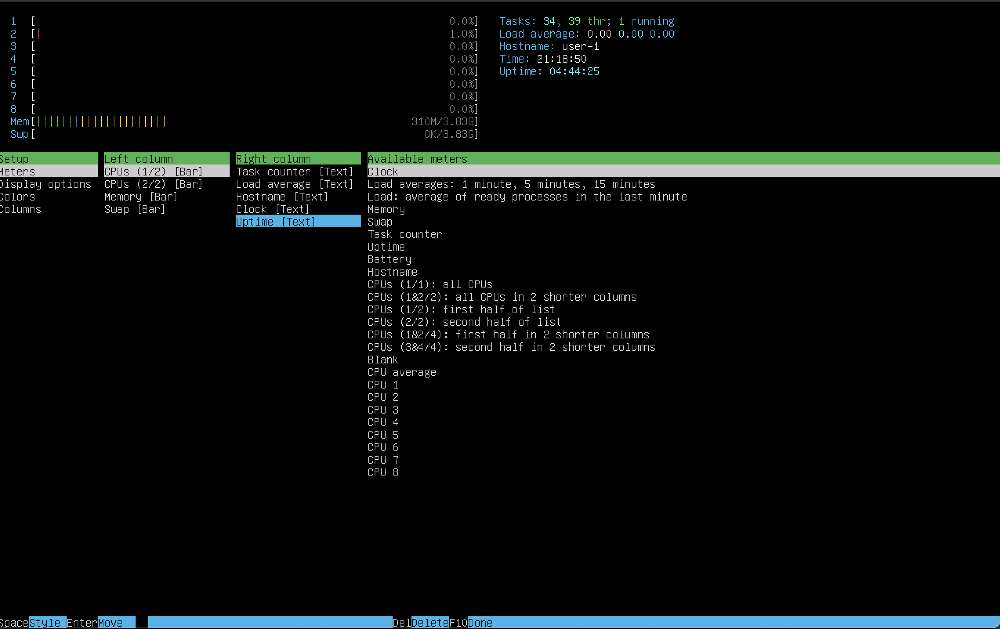
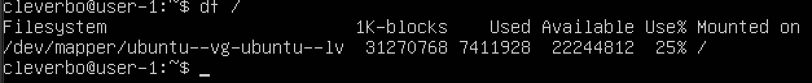

## Part 1. Установка ОС
### Установить Ubuntu 20.04 Server LTS без графического интерфейса.
\
Рисунок 1: Версия убунту

## Part 2. Создание пользователя
### Создать пользователя, отличного от пользователя, который создавался при установке.


### Пользователь должен быть добавлен в группу adm.


### Проверяем был ли создан пользователь.


## Part3. Настройка сети ОС
### Задать название машины вида user-1


### Установить временную зону, соответствующую вашему текущему местоположению.


### Вывести названия сетевых интерфейсов с помощью консольной команды.
\
Заметим, что в выводи присутствует неизвестный нам интерфейс lo.

lo (loopback) - интерфейс локальной петли. Все адреса в сети 127.0.0.1 могут идентифицировать только данную машину и никогда не уходят в сеть. Любая посылка, отправленная на адрес 127.0.0.1, не покинет компьютер (виртуальную машину). Такая адресация может быть использована для взаимодействия между локальными приложениями (Nginx обращается к Apache2, который слушает
TCP порт 80 по адресу 127.0.0.1, PHP обращается к MySQL, который слушает TCP-порт 3306 по адресу 127.0.0.1, и т. д.).

### Используя консольную команду получить ip адрес устройства, на котором вы работаете, от DHCP сервера.
\
Видим, что локальный IP машины - 192.168.64.9

Для работы по сети любому устройству требуется IP-адрес. В протоколе IPv4 это числовой идентификатор, состоящий из 4 разрядов, каждый из которых отделяется точкой, без него устройство не может быть определено в сетевой инфраструктуре. \
Прикладной протокол DHCP выполняет всю работу по подбору сетевых настроек автоматически, без необходимости присваивать вручную каждому устройству свой IP-адрес. Это очень упрощает работу системного администратора в случае расширения сети.

### Определить и вывести на экран внешний ip-адрес шлюза (ip) и внутренний IP-адрес шлюза, он же ip-адрес по умолчанию (gw).
\
Внешний IP шлюза: 2.155.159.223 \
Внутренний IP шлюза: 192.168.64.1

### Задать статичные настройки ip, gw, dns.


1. Изменили конфигурационный файл с помощью vim
2. Применили изменения с помощью ```sudo netplan apply```

### Успешно пропинговать удаленные хосты 1.1.1.1 и ya.ru


## Part 4. Обнавление ОС.
### Обновить системные пакеты до последней на момент выполнения задания версии.


## Part 5. Использование команды sudo
Команда sudo (от англ. SuperUser DO) — это команда в Linux и других Unix-подобных системах, которая позволяет выполнять действия с правами суперпользователя (root).
### Разрешить пользователю, созданному в Part 2, выполнять команду sudo.

### Поменять hostname ОС от имени пользователя, созданного в пункте Part 2.


## Part 6. Установка и настройка службы времени
### Настроить службу автоматической синхронизации времени.


## Part 7. Установка и использование текстовых редакторов
### Установка текстовых редакторов
- Установка текстового редактора vim:\
 `sudo apt install vim`
- Установка текстового редактора nano:\
 `sudo apt install nano`
- Установка текстового редактора mcedit:\
  `sudo apt install mc`
### Создание файла
#### VIM
1. Создайте файл test_vim.txt:\
  `vim test_vim.txt`
2. Для записи в файл: `i`
3. Для выхода из редактора с сохранением: `Esc`, `:`, `wq`


#### NANO
1. Создайте файл test_nano.txt:\
`nano test_nano.txt`
2. Управление:
- `Ctrl+x` - выйти из редактора
- `Y` - сохранить файл
- `Enter`- сохранить с прежним именем


#### MCEDIT
1. Создайте файл test_mcedit.txt:\
`mcedit test_mcedit.txt`
2. Управление:
- `esc` - выйти из редактора
- `Да` - сохранить файл


### Редактирование файла
#### VIM
1. Откройте файл test_vim.txt:\
  `vim test_vim.txt`
2. Для записи в файл: `i`
3. Для выхода из редактора без сохранения: `Esc`, `:`, `q!`


#### NANO
1. Откройте файл test_nano.txt:\
`nano test_nano.txt`
2. Управление
- `Ctrl+x` - выйти из редактора
- `N` - не сохранять изменения


#### MCEDIT
1. Откройте файл test_mcedit.txt:\
`mcedit test_mcedit.txt`
2. Управление:
- `esc` - выйти из редактора
- `Нет` - сохранить файл


### Работа с поиском и заменой в текстовых редакторах
#### **VIM**  
##### **Поиск слова**  
1. Откройте файл:  
   ```bash
   vim test_vim.txt
   ```  
2. Введите команду:  
   ```
   /clever
   ```


#### **Замена слова**  
1. Введите команду:  
   ```
   :%s/старое_слово/новое_слово/g
   ```  
   `%s` — замена во всём файле.  
   `g` — все совпадения в строке.  


---

### **NANO**  
#### **Поиск слова**  
1. Откройте файл:  
   ```bash
   nano test_nano.txt
   ```  
2. Нажмите `Ctrl+W`
3. Введите искомое слово → `Enter`


#### **Замена слова**  
1. Нажмите `Ctrl+\`
2. Введите:  
   - `Старое_слово` → `Enter` 
   - `Новое_слово` → `Enter`
3. Подтвердите замену:  
   - `A` — заменить все

   **Скриншот замены в Nano:**  
   

---

### **MCEdit**  
#### **Поиск слова**  
1. Откройте файл:  
   ```bash
   mcedit test_mcedit.txt
   ``` 
2. Нажмите `F7` → введите слово → `Enter`
   

#### **Замена слова**  
1. Нажмите `F7`
2. Введите:  
   - `Старое_слово` → `Enter` 
   - `Новое_слово` → `Enter`

   


## Part 8. Установка и базовая настройка сервиса SSHD
### Установить службу SSHd.
Установите пакет openssh:
```bash
sudo apt install openssh-server
```

### Добавить автостарт службы при загрузке системы
Добавьте пакет SSH-сервера в автозагрузку:
```bash
sudo systemctl enable ssh
```
Проверьте работу SSH
```bash
systemctl status ssh
```


### Перенастроить службу SSHd на порт 2022
Отредактируйте файл sshd_config с помощью:
```bash 
sudo vim /etc/ssh/sshd_config
```


### Используя команду ps, показать наличие процесса sshd. Для этого к команде нужно подобрать ключи
ps (Process Status) — утилита для вывода информации о запущенных процессах.
- -p \<PID\> — показать только процесс с указанным PID.
- -e — флаг, показать все процессы (не только текущего пользователя).
- | (pipe) — перенаправляет вывод ps в grep.
- grep sshd — фильтрует строки, содержащие "sshd".


### Вывод команды `netstat -tan`


Команда `netstat` выводит сетевые соединения, а флаги `-tan` задают формат вывода:

| Флаг | Описание |
|------|----------|
| **`-t`** | Показать только **TCP-соединения** (исключая UDP и другие протоколы). |
| **`-a`** | Показать **все соединения** (включая слушающие сокеты и установленные подключения). |
| **`-n`** | Выводить **числовые адреса и порты** (без попытки разрешения имён через DNS). |

**Почему `-n` полезен?**  
Без него `netstat` попытается преобразовать IP-адреса в имена хостов (например, `0.0.0.0:22` → `localhost:ssh`), что замедляет вывод.

**Значение `0.0.0.0` и `::`**
- **`0.0.0.0:22`** (IPv4):  
  Сервер слушает **на всех доступных сетевых интерфейсах** (Wi-Fi, Ethernet, локальный интерфейс).  
  **Пример:** SSH-сервер доступен по любому IP-адресу компьютера.

- **`:::22`** (IPv6, аналог `0.0.0.0`):  
  Сервер принимает подключения по IPv6 **на всех интерфейсах**.  
  Если в системе включён IPv6, этот сокет может обрабатывать и IPv4-подключения (зависит от настройки `IPV6_V6ONLY`).


## Part 9. Установка и использование утилит **top**, **htop**
### **top**


| Параметр | Значение | Комментарий |
|----------|----------|-------------|
| **Uptime** | `3:52` | Время работы системы без перезагрузки. |
| **Авторизованные пользователи** | `1 users` | Компьютер использует только 1 пользователь (cleverbo). |
| **Общая загрузка системы (load average)** | `0.75, 0.60, 0.55` | Средняя загрузка за 1, 5 и 15 минут. |
| **Общее количество процессов** | `159 total` | Из них `1` работает, `158` спят. |
| **Загрузка CPU** | `100% idle` | CPU не нагружен. |
| **Загрузка памяти** | `307.0 MiB used ` | Память заполнена на 10%. |
| **PID процесса с max памятью** | `PID: 3238 (fwupd)` | Занимает 2% памяти. |
| **PID процесса с max TIME** | `PID: 645 (multipathd)` | `0:09:03` процессорного времени. |

#### **Управление `top`:**
| Команда | Действие |
|---------|----------|
| `Shift + M` | Сортировка по **памяти**. |
| `Shift + T` | Сортировка по **времени работы**. |

#### Сортировка по памяти:


#### Сортировка по времени:


### **htop**
1. **Сортировка:**  
   - По `PID` → `F6` → Выбрать `PID`.
   
   - По `PERCENT_CPU` → `F6` → Выбрать `CPU%`.
   
   - По `PERCENT_MEM` → `F6` → Выбрать `MEM%`.
   
   - По `TIME` → `F6` → Выбрать `TIME+`.
   

2. **Фильтр для `sshd`:**
   - Нажать `F4` → Ввести `sshd`.
   

3. **Поиск `syslog`:**
   - Нажать `F3` → Ввести `syslog` → Enter.
   

4. **Дополнительная информация:**  
   - Включить `hostname`, `clock`, `uptime` через `F2` → `Meters`.
   

## Part 10. Использование утилиты **fdisk**
### Запуск команды `fdisk -l`:


### Жесткий диск:
| Название | Размер | Количество секторов | 
|---------|----------|----------|
| /dev/vda | 64 GiB | 127817728 |

### Swap
### Запуск команды `swapon --show`:


## Part 11. Использование утилиты **df**


#### **Результат `df /`:**  
- **Размер:** `31270768 KB`
- **Занято:** `7411928 KB`
- **Свободно:** `22244812 KB`
- **Использование:** `25%`  
- **Единица измерения:** **Килобайты (1K-blocks)**  


#### **Результат `df -Th /`:**  
- **Тип ФС:** `ext4`  
- **Размер:** `30G`  
- **Занято:** `7,1G`  
- **Свободно:** `22G`  
- **Использование:** `25%`  
- **Единица измерения:** **Гигабайты (автомасштабирование)**  


## Part 12. Использование утилиты **du**
### Вывести размер папок /home, /var, /var/log


### Вывести размер всего содержимого в /var/log


## Part 13. Установка и использование утилиты **ncdu**
### Установка: `sudo apt install ncdu`
### Размер /home:


### Размер /var:


### Размер /var/log:


## Part 14. Работа с системными журналами
### **1. Просмотр лог-файлов**

**1.1. `/var/log/dmesg`**  
Содержит журнал сообщений ядра.
```bash
sudo less /var/log/dmesg
```

**1.2. `/var/log/syslog`**  
Основной системный лог.
```bash
sudo less /var/log/syslog
```

**1.3. `/var/log/auth.log`**  
Лог аутентификации (ключевой файл для задания).  
```bash
sudo less /var/log/syslog
```

---

#### **2. Поиск последней успешной авторизации**  
**Команда для поиска:**  
```bash
sudo grep -a "sesson opened" /var/log/auth.log | tail -n 1
```
**Параметры для отчёта:**  
- **Время:** `May 11 15:05:18`  
- **Имя пользователя:** `cleverbo`  
- **Метод входа:** `Локальный вход через консоль`

**Скриншот:**  


---

#### **3. Перезапуск службы SSHd**  
**Команда:**  
```bash
sudo systemctl restart sshd
```

**Поиск сообщения о рестарте в логах:**  
```bash
sudo grep -a "Secure Shell" /var/log/syslog | tail -n 4
```

**Скриншот:**


## Part 15. Использование планировщика заданий **CRON**
### Создание задания в CRON для команды uptime каждые 2 минуты

Откроем crontab для редактирования:
```bash
crontab -e
```

Добавим строку:
```
*/2 * * * * uptime
```

#### Поиск записей в системных журналах

Просмотрим логи CRON (для Ubuntu/Debian):
```bash
grep CRON /var/log/syslog | grep uptime
```

Вывод:


#### Просмотр текущих заданий CRON

Выполним:
```bash
crontab -l
```

Вывод: \


### Удаление всех заданий из CRON

Выполним:
```bash
crontab -r
```

Проверим, что задания удалены:
```bash
crontab -l
```

Вывод: \
